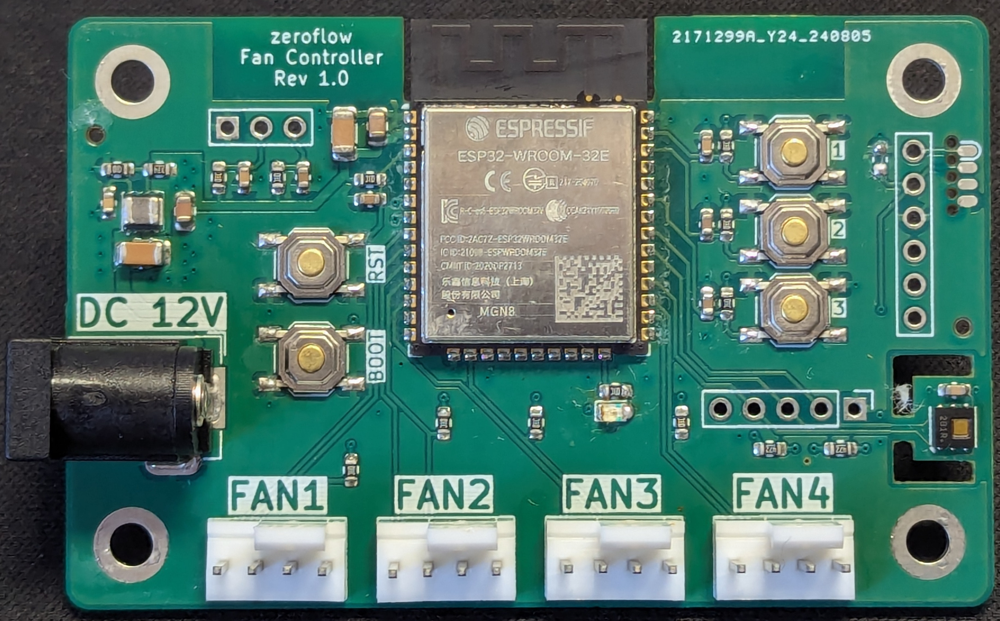

# ESP32 Fancontroller

## Specs

* 12V DC Barrel Input (5.5x2.1mm)
* 4x PWM Fan Output
* Integrated HDC1080 Temperature & Humidity Sensor
* I2C Expansion Port
* 3 User Buttons
* 2 External Digital Inputs (Pull-Up included)

## 3D printed case

TBD

## Tindie

TBD