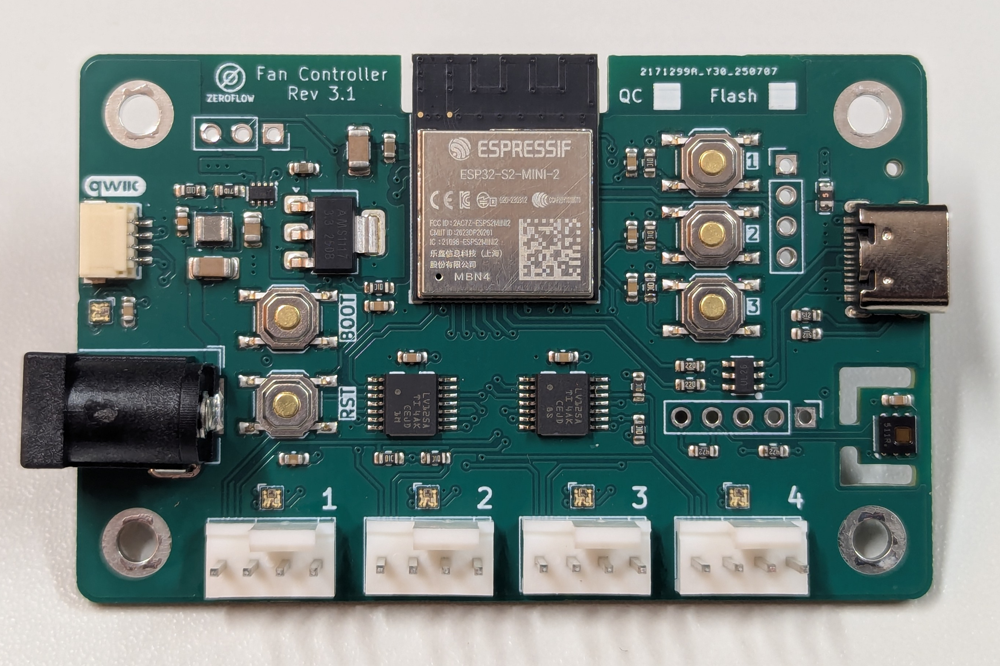

# ESP32 Fancontroller

ESP32-based PWM Fancontroller with integrated Temperature & Humdity Sensor.

## Specification

* Basics
  * 12V DC Barrel Input (5.5x2.1mm)
  * 4x PWM Fan Output
* Sensors & IO
  * Integrated HDC1080 Temperature & Humidity Sensor
  * RGB Status LEDs (Board + Fans)
  * [Qwiic](https://www.sparkfun.com/qwiic) Expansion Port
  * I2C Expansion Port (2.54mm Header)
  * Neopixel Port
  * 3 User Buttons
  * GPIO Expansion Pads (2.54mm SMD Header)



## 3D printed case

[Wifi Fancontroller Case](https://www.printables.com/model/987263-wifi-fancontroller-case) on Printables.com

## Tindie

Buy boards & cases at https://www.tindie.com/products/zeroflow/esp32-fancontroller/

## Installation

> **Warning**
> This section is a work in progress. If you need assistance, please contact me on Github or on Tindie.

The boards come pre-flashed with an ESPHome factory image.
There are many ways to install your own firmware, but the most common will be USB, OTA (upload) or OTA (Adoption).

Always pick the correct configuration for your board revision.
To distinguish the boards inside the case, the following scheme can be used:

Revision | Left                      | Fan Ports             | Right   | Details | Notes
---- | ----------------------------- | --------------------- | ------- | ------- | ------
1.0  | DC 12V                        | Fans                  | nothing | [Link](https://zeroflow.github.io/esphome-fancontroller/fancontroller-rev1.0.html) |
2.0  | DC 12V, Status LED            | Fans                  | USB-C   | [Link](https://zeroflow.github.io/esphome-fancontroller/fancontroller-rev2.0.html) | 
3.0  | DC 12V, Status LED, QWIIC     | Fans                  | USB-C   | [Link](https://zeroflow.github.io/esphome-fancontroller/fancontroller-rev3.0.html) |
3.1  | DC 12V, RGB Status LED, QWIIC | Fans, RGB Status LEDs | USB-C   | [Link](https://zeroflow.github.io/esphome-fancontroller/fancontroller-rev3.1.html) |
3.2  | DC 12V, RGB Status LED, QWIIC | Fans, RGB Status LEDs | USB-C   | TBD | ESPHome config identically to Rev 3.1, internal changes
3.3  | DC 12V, RGB Status LED, QWIIC | Fans, RGB Status LEDs | USB-C   | TBD | ESPHome config identically to Rev 3.1, internal changes

### Installation of prebuilt config via Web-UI

Controllers can be flashed with a default firmware via the [Installer on GitHub Pages](https://zeroflow.github.io/esphome-fancontroller/)

### Preparation of Config

* Create a new device in your ESPHome installation
* Merge content of template (e.g. [fancontroller-rev3.1-esp32s2.yaml](/fancontroller-rev3.1-esp32s2.yaml)) into your generated config, preserving the generated header
  * Keep your generated key inside ```api:``` and ```ota:```
  * Important sections for changes are denoted with ```<----------- Merge your generated config here```, ```<----------- Enable this``` or  ```<----------- Remove this if not needed```

### ESPHome Web Installation

* Create your own config as noted above
* Click Install -> Manual Download
* The firmware will now be built, this may take some time
* Download "Factory format"
* Open [ESPHome Web](https://web.esphome.io/)
* Connect your board to the computer via USB-C
* The board will light up in default mode: Green Status LED, running LEDs at fan port
* Hold down Boot and press Reset to go into Download Mode
* Click "Connect"
* Select ```ESP32-S2 COMx```
* Click "Install"
* Select the file you downloaded ```*.factory.bin```
* Click "Install"
* Wait for installation to finish
* Press the reset button to boot into your software

> If you want to see progress, press F12 for the developer menu and select the "Console" tab. ESPhome will output log messages there.

### USB Installation

> For USB Installation, you need to have esphome installed with a valid ssh certificate, as this is needed for WebSerial installation.

* Create your own config as noted above
* Connect your board to the computer via USB-C
* The board will light up in default mode: Green Status LED, running LEDs at fan port
* Hold down Boot and press Reset to go into Download Mode
* Click Install -> Plug into this computer 
* Select ```ESP32-S2 COMx```
* Click "Connect"
* The firmware will now be built, this may take some time
* Wait for installation to finish
* Press the reset button to boot into your software

> If you want to see progress, press F12 for the developer menu and select the "Console" tab. ESPhome will output log messages there.

### OTA - Upload Installation

* Create your own config as noted above
* Click Install -> Manual Download
* The firmware will now be built, this may take some time
* Download "OTA format"
* Connect the board to power (USB-C or DC 12V)
* The board will light up in default mode: Green Status LED, running LEDs at fan port
* A new WiFi network will be visible (e.g. ```fancontroller-r3-1-abcdef```)
* Connect to this WiFi network
* Typically, the captive portal will be loaded automatically
  * If not, navigate to [192.168.4.1](http://192.168.4.1)
* Select the file you just downloaded at the bottom of the page under "OTA Update"
* Click "Update"
* The board will now reboot and be visible in ESPHome

### OTA - Adoption Installation

> This method is the most complicated one.

* Connect the board to power (USB-C or DC 12V)
* The board will light up in default mode: Green Status LED, running LEDs at fan port
* A new WiFi network will be visible (e.g. ```fancontroller-r3-1-abcdef```)
* Connect to this WiFi network
* Typically, the captive portal will be loaded automatically
  * On Android, the system may ask you to stay connected to a WiFi without internet access
  * If not, navigate to [192.168.4.1](http://192.168.4.1)
* Select your WiFi and input the password
* Click "Save"
* If successful, the LEDs behind the fan ports will change to green.
* The board will now connect to your wifi. Use your method of discovery to find the IP address, access the web UI and flash a new config via OTA upload.

## Further updates

After the initial programming, the board should become available in the ESPHome Web UI. If this is not the case, check for general network or mDNS issues. If the device correctly connects to your Wifi, you may be able to work around mDNS issues by manually specifying [manual_ip:](https://esphome.io/components/wifi.html) inside the wifi settings to manually point ESPHome to the correct IP address.
