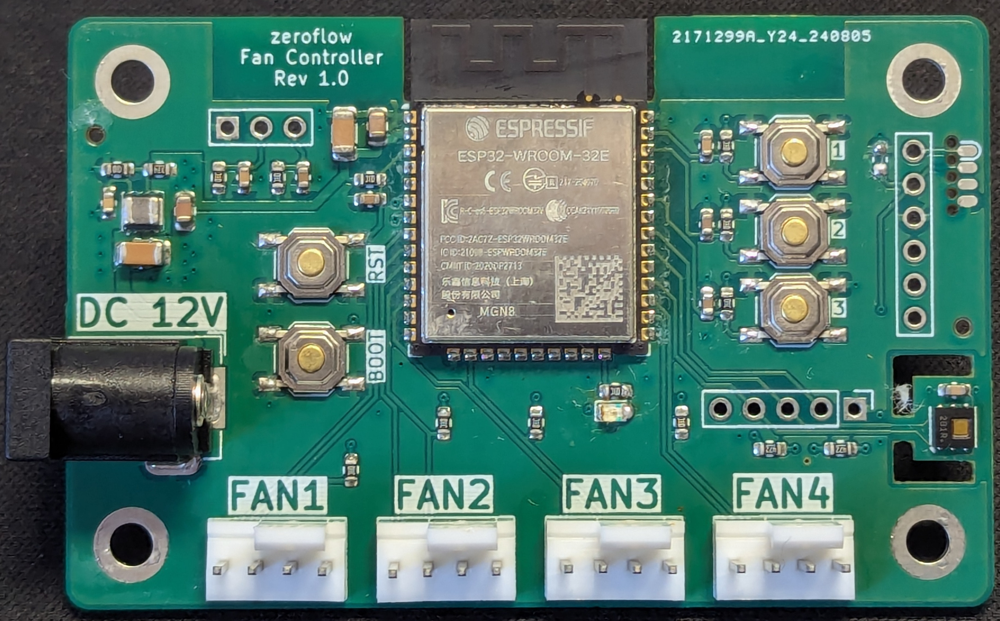

## Description

* Main Controller
  * ESP32-WROOM-32E
* Onboard
  * DC Input (12V, 5.5x2.1mm)
  * Serial flashing header (100mil & SOCbite)
  * 4x FAN PWM Header
  * Status LED (red)
  * HDC1080 Temperature & Humidity sensor
* IO
  * Reset / Boot Buttons
  * 3x User Buttons
  * 2x External Input (100mil)
  * I2C Expansion Port (100mil, SCL, SDA & Int)

## Generic Firmware Instalation

<esp-web-install-button manifest="firmware/fancontroller-r1-0.manifest.json"></esp-web-install-button>

## Example Config File

[Base Config - 4 fans](https://github.com/zeroflow/esphome-fancontroller/blob/main/fancontroller-rev1.0-esp32.yaml)

## Board

## ESP32 Pin Assignment

Pin    | Usage
------ | ------
GPIO0  | Boot Button, Push to enter flashing mode
GPIO1  | Serial TX
GPIO2  | Builtin LED, Low=On
GPIO3  | Serial RX
GPIO4  | Fan 4 PWM
GPIO5  | Unused (strapping pin)
GPIO12 | Unused (strapping pin)
GPIO13 | Fan 3 Speed Sense
GPIO14 | Unused (outputs PWM at boot)
GPIO15 | Unused (outputs PWM at boot, strapping pin)
GPIO16 | Fan 4 Speed Sense
GPIO17 | I2C SDA (HDC1080 + expansion header)
GPIO18 | I2C SCL (HDC1080 + expansion header)
GPIO19 | I2C INT (expansion header)
GPIO21 | User Button 3
GPIO22 | User Button 2
GPIO23 | User Button 1
GPIO25 | Fan 2 PWM
GPIO26 | Fan 2 Speed Sense
GPIO27 | Fan 3 PWM
GPIO32 | Fan 1 PWM
GPIO33 | Fan 1 Sense
GPIO34 | External Input 1
GPIO35 | External Input 2
GPIO36 | Unused
GPIO39 | Unused

## I2C Expansion Port

The board offers an I2C extension port above Fan 4.

Nr. | Pin -| Description
----|------|------------
1   | GND  | 
2   | INT  | GPIO 19
3   | SCL  | GPIO 18, 4.7k Pull-Up
4   | SDA  | GPIO 17, 4.7k Pull-Up
5   | +3V3 |

## External Input Port

The board offers two external inputs, e.g. for a door intrusion alarm or a 100% power switch.

Nr. | Pin -| Description
----|------|------------
1   | GND  | 
2   | IN2  | 10k Pull-Up
3   | IN1  | 10k Pull-Up

