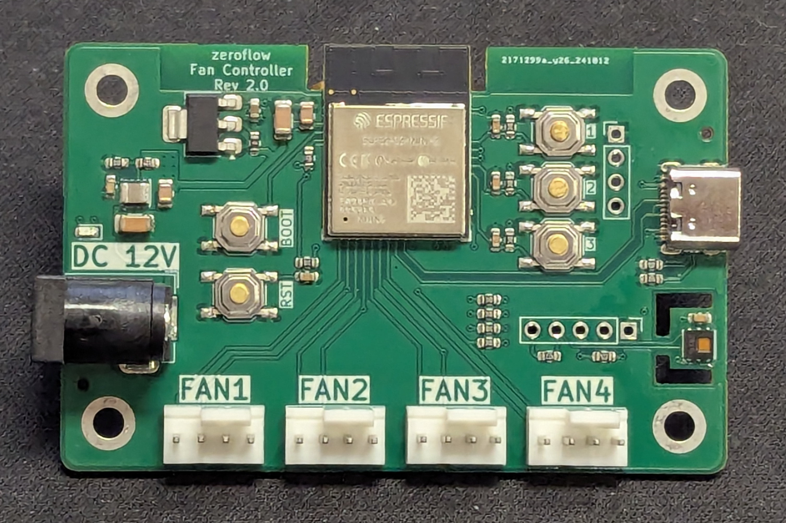

## Description

* Main Controller
  * ESP32S2-Mini-2
* Onboard
  * DC Input (12V, 5.5x2.1mm)
  * USB-C port for flashing
  * 4× FAN PWM Header
  * Status LED (red)
  * HDC1080 Temperature & Humidity sensor
* IO
  * Reset / Boot Buttons
  * 3× User Buttons
  * I2C Expansion Port (100mil, SCL, SDA & Int)

## Generic Firmware Installation

<esp-web-install-button manifest="firmware/fancontroller-r2-0.manifest.json"></esp-web-install-button>

> **Note:** ESP32-S2 boards may have connectivity issues with web-based flashing. If browser flash fails, use [esptool](https://github.com/espressif/esptool) for reliable flashing:
>
> ```bash
> esptool.py --chip esp32s2 write_flash 0x0 firmware.bin
> ```
>
> [Download prebuilt binary](/firmware/fancontroller-r2-0-esp32s2.factory.bin)

## Example Configurations

This board uses a modular package-based configuration system. Check out these examples to get started:

- **[Basic Configuration](https://github.com/zeroflow/esphome-fancontroller/blob/main/examples/basic-rev-2.0.yaml)** - Minimal setup with 4 fans and essential features

For more examples and advanced features, see the [examples directory](https://github.com/zeroflow/esphome-fancontroller/tree/main/examples).

## Board



## ESP32S2 Pin Assignment

Pin    | Usage
------ | ------
GPIO0  | Boot Button, Push to enter flashing mode
GPIO1  | Builtin LED, Low=On
GPIO2  | unused
GPIO3  | unused
GPIO4  | unused
GPIO5  | unused
GPIO6  | unused
GPIO7  | unused
GPIO8  | unused
GPIO9  | unused
GPIO10 | unused
GPIO11 | unused
GPIO12 | Fan 1 PWM
GPIO13 | Fan 1 Sense
GPIO14 | Fan 2 PWM
GPIO15 | Fan 2 Speed Sense
GPIO16 | Fan 3 PWM
GPIO17 | Fan 3 Speed Sense
GPIO18 | Fan 4 PWM
GPIO21 | Fan 4 Speed Sense
GPIO26 | unused
GPIO33 | unused
GPIO34 | unused
GPIO35 | unused
GPIO36 | unused
GPIO37 | unused
GPIO38 | unused
GPIO39 | unused
GPIO40 | unused
GPIO41 | unused
GPIO42 | unused
GPIO45 | unused (strapping)
GPIO46 | unused (strapping)

### I2C extension port

The board offers an I2C extension port above Fan 4.

Nr. | Pin -| Description
----|------|------------
1   | GND  | 
2   | INT  | GPIO 35
3   | SCL  | GPIO 34, 4.7k Pull-Up
4   | SDA  | GPIO 33, 4.7k Pull-Up
5   | +3V3 |

<script type="module" src="https://unpkg.com/esp-web-tools@8.0.6/dist/web/install-button.js?module"></script>