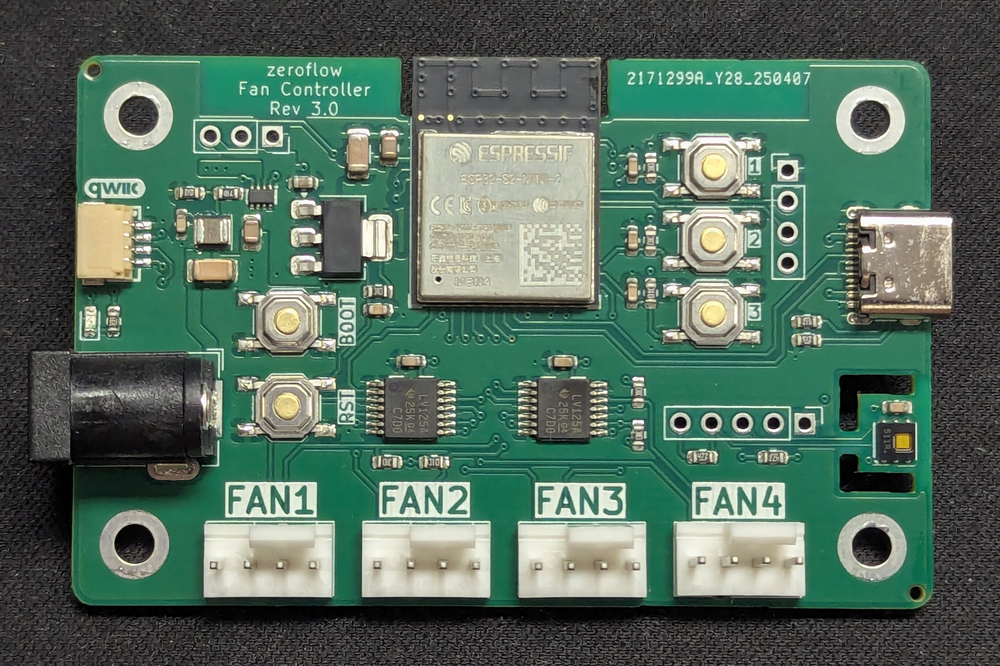
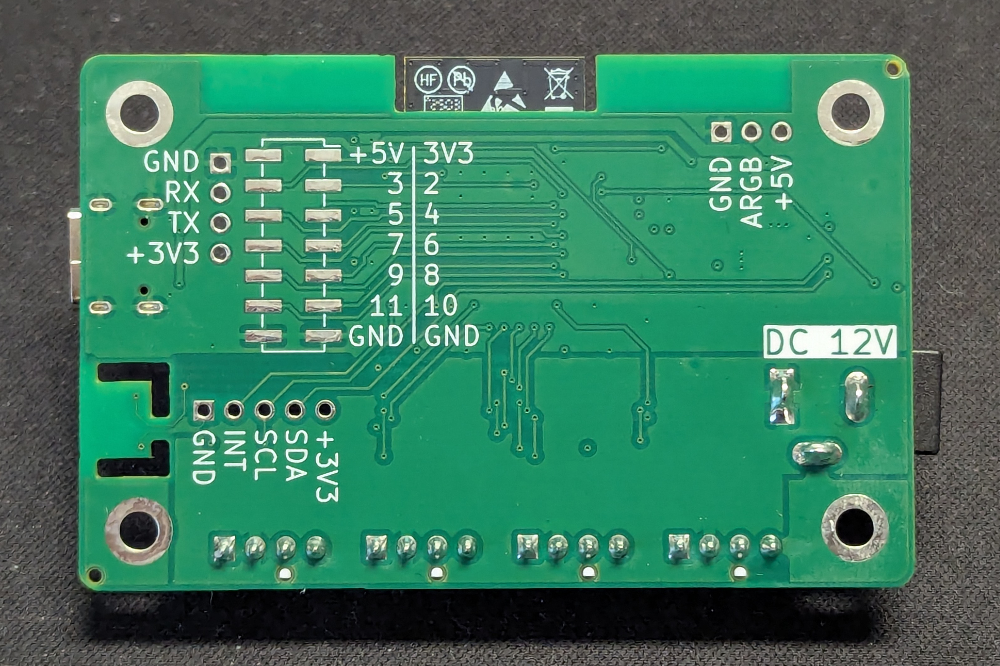

## Description

* Main Controller
  * ESP32S2-Mini-2
* Onboard
  * DC Input (12V, 5.5x2.1mm)
  * USB-C port for flashing
  * 4× FAN PWM Header
    * Buffering for improved signal integrity and resilience
  * Status LED (red)
  * HDC1080 Temperature & Humidity sensor
* IO
  * Reset / Boot Buttons
  * 3× User Buttons
  * QWIIC Expansion port
  * I2C Expansion Port (100mil, SCL, SDA & Int)
  * Neopixel Port (5V, max. 2A total)

> **_NOTE:_**  The neopixel port requires usage of the ```arduino``` framework, since GPIO42 requires use of the ```fastled_clockless``` platform, which is not supported on ```esp-idf```.

## Generic Firmware Installation

<esp-web-install-button manifest="firmware/fancontroller-r3-0.manifest.json"></esp-web-install-button>

> **Note:** ESP32-S2 boards may have connectivity issues with web-based flashing. If browser flash fails, use [esptool](https://github.com/espressif/esptool) for reliable flashing:
>
> ```bash
> esptool.py --chip esp32s2 write_flash 0x0 firmware.bin
> ```
>
> [Download prebuilt binary](/firmware/fancontroller-r3-0-esp32s2.factory.bin)

## Example Config File

[Base Config - 4 fans](https://github.com/zeroflow/esphome-fancontroller/blob/main/fancontroller-rev3.0-esp32s2.yaml)

## Board

### Front



### Back



## ESP32S2 Pin Assignment

Pin    | Usage
------ | ------
GPIO0  | Boot Button, Push to enter flashing mode
GPIO1  | Builtin LED, Low=On
GPIO2  | Expansion Header (Bottom)
GPIO3  | Expansion Header (Bottom)
GPIO4  | Expansion Header (Bottom)
GPIO5  | Expansion Header (Bottom)
GPIO6  | Expansion Header (Bottom)
GPIO7  | Expansion Header (Bottom)
GPIO8  | Expansion Header (Bottom)
GPIO9  | Expansion Header (Bottom)
GPIO10 | Expansion Header (Bottom)
GPIO11 | Expansion Header (Bottom)
GPIO12 | Fan 1 PWM
GPIO13 | Fan 2 PWM
GPIO14 | Fan 3 PWM
GPIO15 | Fan 4 PWM
GPIO16 | Fan 1 Speed Sense
GPIO17 | Fan 2 Speed Sense
GPIO18 | Fan 3 Speed Sense
GPIO21 | Fan 4 Speed Sense
GPIO26 | unused
GPIO33 | I2C SDA
GPIO34 | I2C SCL
GPIO35 | I2C INT
GPIO36 | USR3
GPIO37 | USR2
GPIO38 | USR1
GPIO42 | Neopixel Expansion Port
GPIO45 | unused (strapping)
GPIO46 | unused (strapping)

## I2C extension port

The board offers an I2C extension port above Fan 4.

Nr. | Pin -| Description
----|------|------------
1   | GND  | 
2   | INT  | GPIO 35
3   | SCL  | GPIO 34, 4.7k Pull-Up
4   | SDA  | GPIO 33, 4.7k Pull-Up
5   | +3V3 |

## SMD Expansion Port

The board offers an SMD expansion port on the back.

Nr. | Pin -| Description
----|------|------------
1   | +3V3 | 
2   | +5V  | 
3   | I/O  | GPIO02
4   | I/O  | GPIO03
5   | I/O  | GPIO04
6   | I/O  | GPIO05
7   | I/O  | GPIO06
8   | I/O  | GPIO07
9   | I/O  | GPIO08
10  | I/O  | GPIO09
11  | I/O  | GPIO10
12  | I/O  | GPIO11
13  | GND  | 
14  | GND  | 

<script type="module" src="https://unpkg.com/esp-web-tools@8.0.6/dist/web/install-button.js?module"></script>