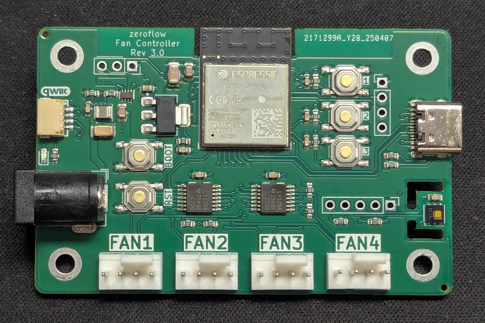

# About

A ESP32-based Fan Controller

General specifications for all revisions

* 12V DC Barrel Input (5.5x2.1mm)
* 4x PWM Fan Output
* Integrated HDC1080 Temperature & Humidity Sensor

## Revision history

### 1.0 - ESP32

Original Design with an ESP32, supports only flashing via 100mil header or SOCbite connector on board.

[Details](fancontroller-rev1.0.md)

### 2.0 - ESP32S2

Change of main controller from ESP32 to ESP32S2 to allow flashing via USB-C without the need for serial programming adapters.

[Details](fancontroller-rev2.0.md)

### 3.0 - Resiliency

Changes for signal & resiliency (fan ports), QWIIC I2C port, 5V Neopixel port, and SMD expansion header for unused pins.

[Details](fancontroller-rev3.0.md)

### 3.1 - RGB & Resiliency

Changes for signal & resiliency (USB), RGB LEDs (SK6805) for the board and for each fan port

[Details](fancontroller-rev3.1.md)

# Installation

You can use the button below to install the pre-built firmware directly to your device via USB from the browser.

<esp-web-install-button manifest="firmware/fancontroller-esp32.manifest.json"></esp-web-install-button>

