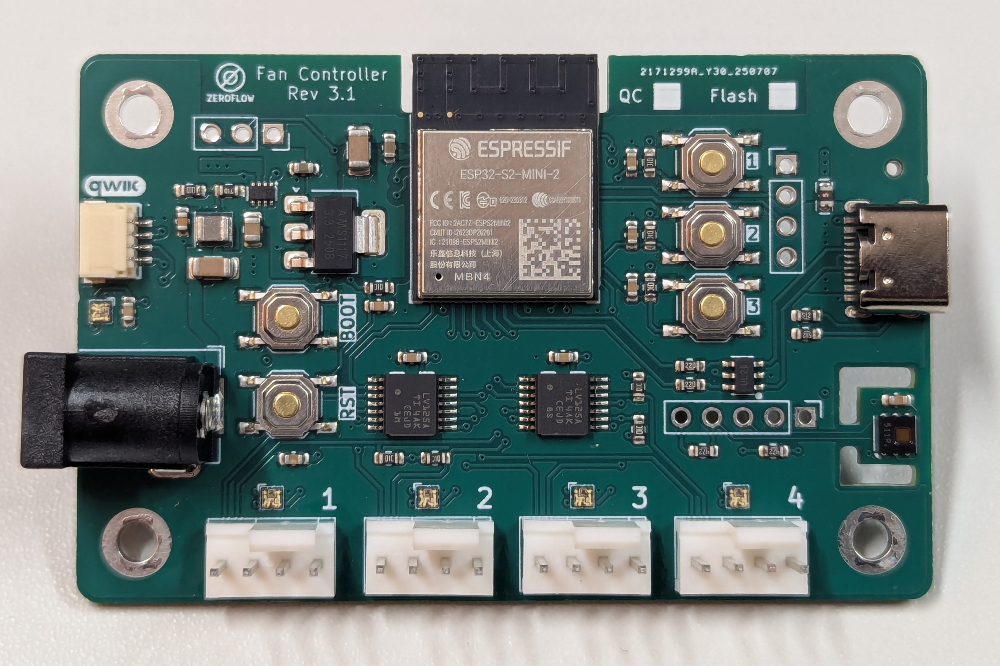

# About

An ESP32-based Fan Controller

General specifications for all revisions

* 12V DC Barrel Input (5.5x2.1mm)
* 4x PWM Fan Output
* Integrated HDC1080 Temperature & Humidity Sensor

## Installation

You can use the buttons below to install the pre-built firmware directly to your device via USB from the browser.

## Revisions

### 1.0 - ESP32

Original Design with an ESP32, supports only flashing via 100mil header or SOCbite connector on board.

<esp-web-install-button manifest="firmware/fancontroller-r1-0.manifest.json"></esp-web-install-button>

[Board Details](fancontroller-rev1.0.md)

### 2.0 - ESP32S2

Change of main controller from ESP32 to ESP32S2 to allow flashing via USB-C without the need for serial programming adapters.

<esp-web-install-button manifest="firmware/fancontroller-r2-0.manifest.json"></esp-web-install-button>

[Board Details](fancontroller-rev2.0.md)

### 3.0 - Resiliency

Changes for signal & resiliency (fan ports), QWIIC I2C port, 5V Neopixel port, and SMD expansion header for unused pins.

<esp-web-install-button manifest="firmware/fancontroller-r3-0.manifest.json"></esp-web-install-button>

[Board Details](fancontroller-rev3.0.md)

### 3.1, 3.2, 3.3 - Latest Generation

RGB LEDs (SK6805) for board and fan port status, improved signal and USB resilience. Hardware revisions 3.2 and 3.3 include minor component upgrades.

<esp-web-install-button manifest="firmware/fancontroller-r3-1.manifest.json"></esp-web-install-button>

[Board Details Rev 3.1](fancontroller-rev3.1.md) | [Rev 3.2](fancontroller-rev3.2.md) | [Rev 3.3](fancontroller-rev3.3.md)

